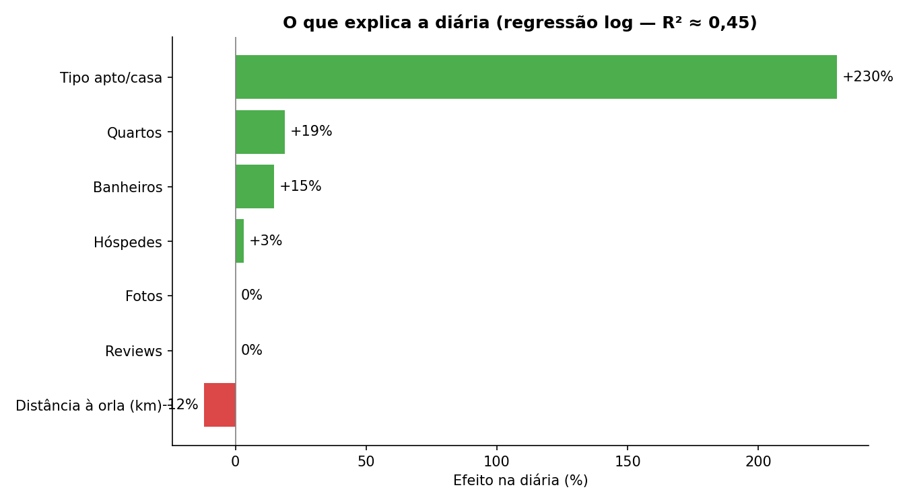
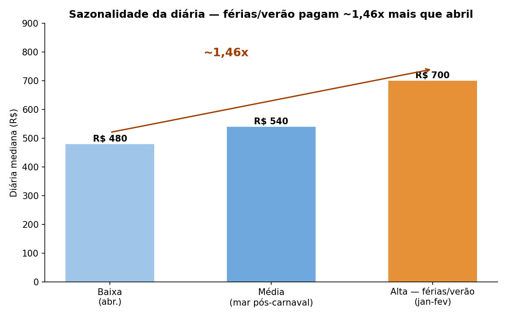
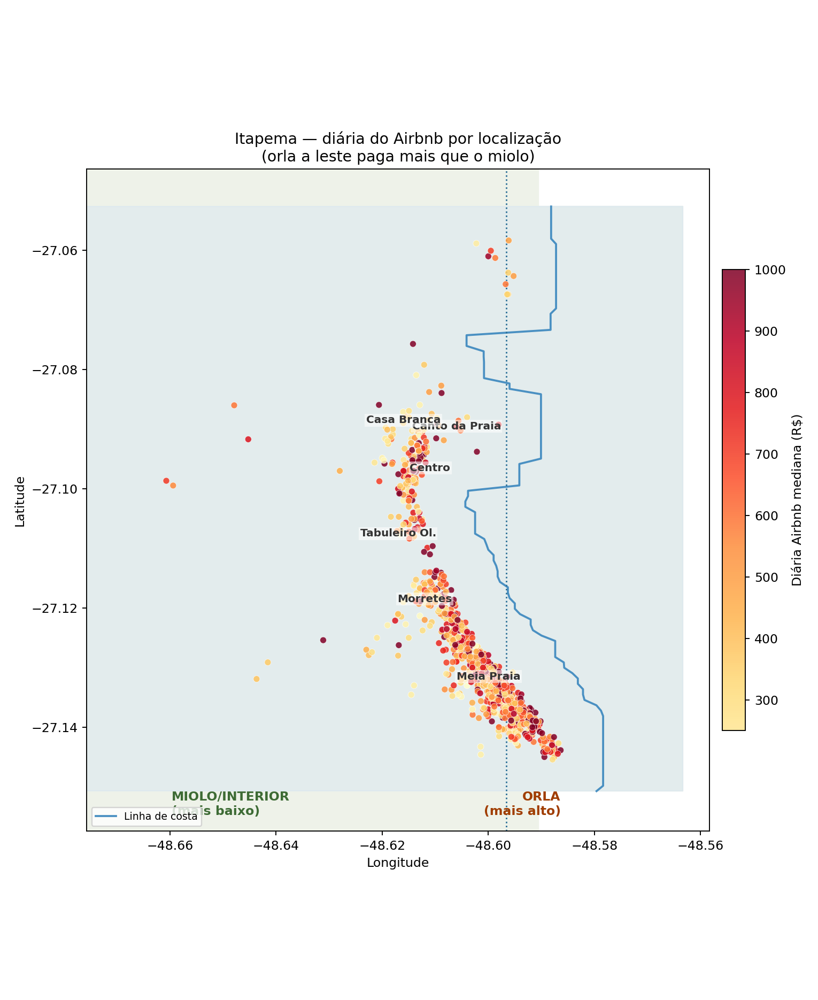
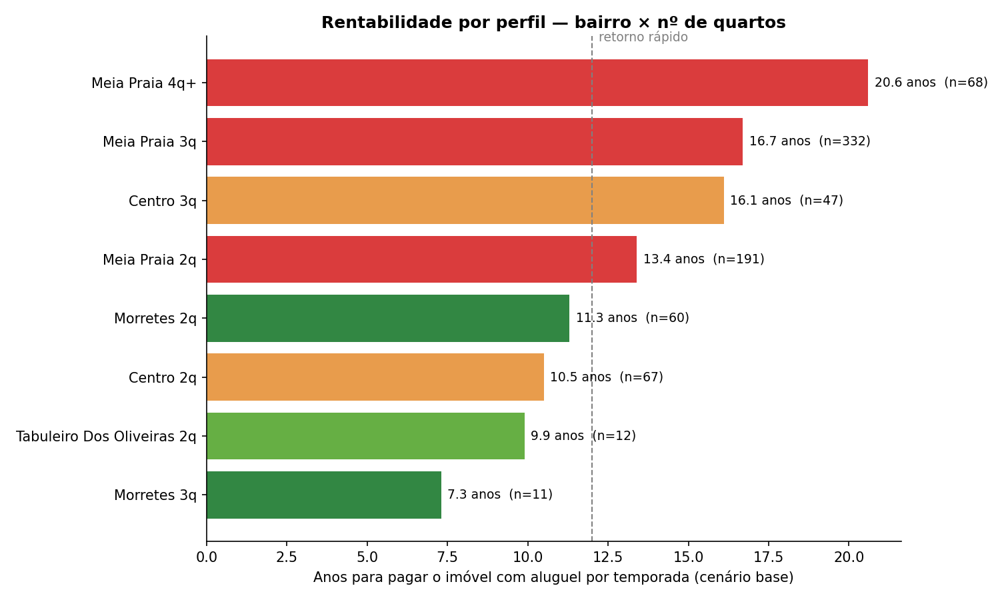
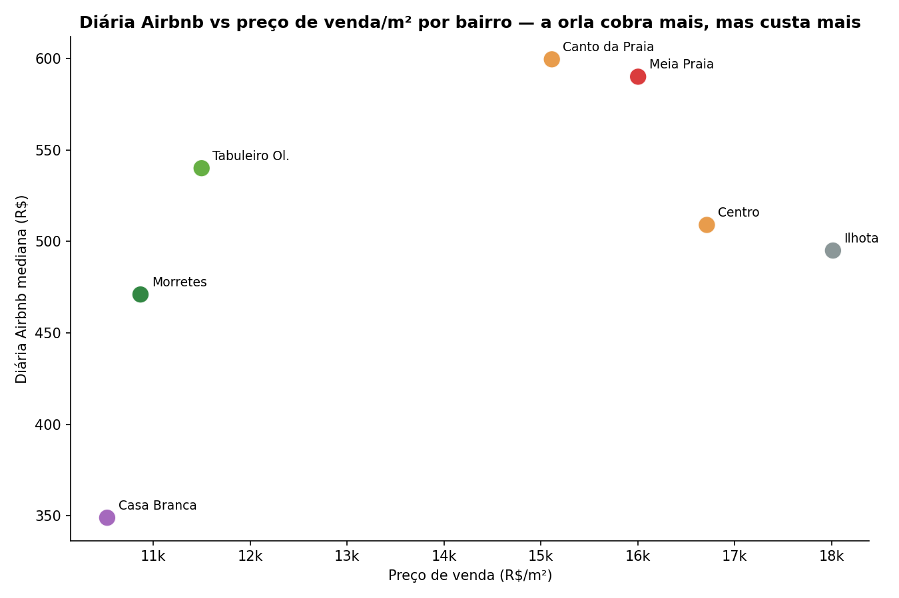

# Onde vale a pena comprar para alugar por temporada em Itapema

Análise que cruza o mercado de **aluguel de temporada (Airbnb)** com o de
**compra (VivaReal)** para identificar quais regiões e perfis de imóvel geram
melhor retorno.

> Como ler: cada seção é um gráfico com uma legenda simples. Os métodos por trás
> estão no notebook `analise_itapema.ipynb` e nos detalhes do `README_analisis.md`.

---

## 1. O que faz a diária subir

O tamanho do imóvel e o tipo são os principais motores do preço. Fotos e nº de
reviews quase não importam.

**Em uma frase:** cada quarto extra vale ~19% a mais na diária, e estar perto do
mar vale ~12% por km de distância.

---

## 2. A diária é muito sazonal

O verão/férias paga bem mais que o resto do ano.

**Em uma frase:** férias/verão pagam **~1,46x** a diária de abril.

---

## 3. Onde estão as diárias mais altas (mapa)

A orla (faixa leste, perto do mar) concentra as diárias mais altas; o miolo
(interior) tem diárias menores.

**Em uma frase:** mais perto do mar = diária maior, e isso aparece no mapa.

---

## 4. Comprar para alugar: quanto tempo até pagar o imóvel

Com base na receita potencial (diária sazonal × cenário de ocupação), veja quantos
anos de aluguel levam para "pagar" o imóvel em cada perfil.

**Em uma frase:** **Morretes 3 quartos** é o perfil mais interessante (~7 anos);
os bairros da orla (Meia Praia, Centro) demoram muito mais (~13–21 anos).

---

## 5. Por quê: diária alta ≠ retorno bom

Os bairros da orla cobram uma diária mais alta, mas o preço de compra por m² é
muito maior — o que anula a vantagem.

**Em uma frase:** Morretes/Tabuleiro ficam no melhor equilíbrio "diária boa +
preço baixo"; Meia Praia/Centro/Ilhota são caros por m².

---

## Conclusão em 3 pontos

1. **Diária é boa na orla**, mas o **retorno de aluguel é melhor no miolo**
   (Morretes, Tabuleiro) porque o imóvel é muito mais barato.
2. **O melhor perfil de compra para alugar** encontrado: **Morretes, 3 quartos**
   (~7 anos no cenário base), ainda que com amostra pequena.
3. **A diária em férias/verão é ~46% maior** que em abril — quem compra para
   temporada precisa planejar a sazonalidade.

> ⚠️ Precauções de leitura: receita é **potencial** (a ocupação usa cenários, não
> dados reais de reserva); a diária é a lista, não a cobrada; e a análise vale
> para o **mercado ativo** (anúncios com preço). Veja `README_analisis.md`.
